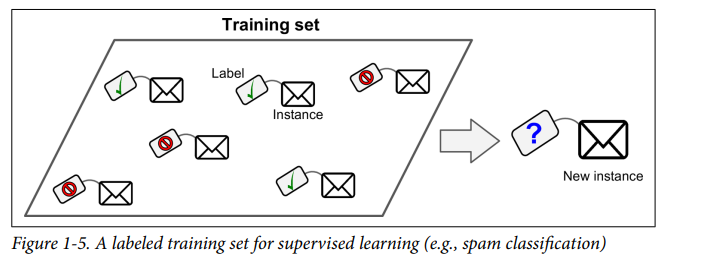
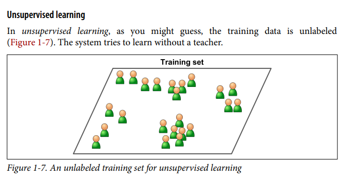
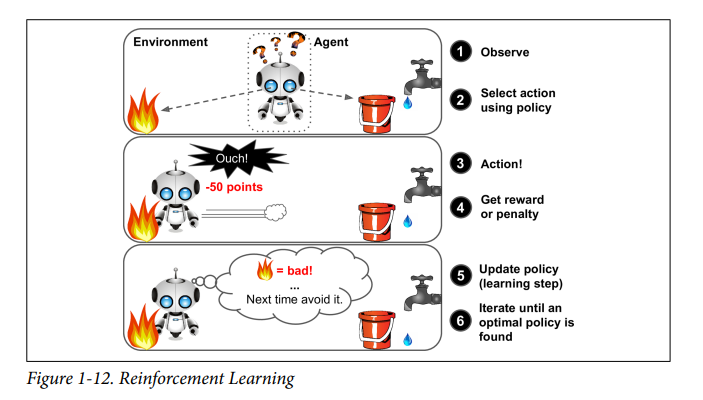
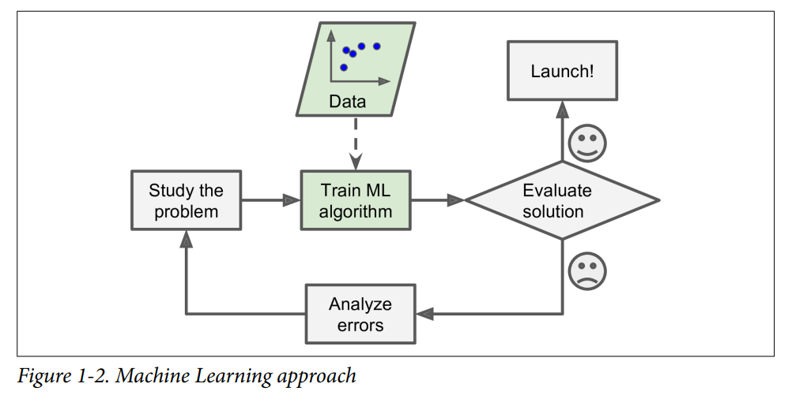

## Day 1: Introduction to Machine Learning

### Topics Covered
- What is Machine Learning? Importance and Applications
   `Machine Learning is a subset of AI that enables systems to learn and improve from experience without being explicitly programmed.`
- Types of Machine Learning:
  - Supervised Learning 
  
  - Unsupervised Learning
  - Reinforcement Learning
- Basic workflow of an ML project
### ML Terminologies:
- **Algorithm**: Steps for solving problems (e.g., decision tree).
- **Model**: Learned system (e.g., spam filter).
- **Training**: Learning from data (e.g., showing photos to a model).
- **Dataset**: Data collection (e.g., cat images).
- **Feature**: Input data detail (e.g., pet size).
- **Label**: Correct output (e.g., "cat" or "dog").
- **Overfitting**: Model too specific (e.g., memorizes training data).
- **Underfitting**: Model too simple (e.g., can't distinguish cats from dogs).
- **Supervised Learning**: Labeled data (e.g., images with "cat" or "dog").
- **Unsupervised Learning**: No labels (e.g., finding groups in random data).
- **Classification**: Predicting categories (e.g., email: spam or not).
- **Regression**: Predicting numbers (e.g., house price prediction).
- **Clustering**: Grouping (e.g., grouping similar customers).
- **Accuracy**: Correct predictions (e.g., 90% right guesses).
- **Loss Function**: Measures errors (e.g., how far off predictions are).
- **Gradient Descent**: Improves model (e.g., reduces errors step-by-step).
- **Epoch**: Full pass of data (e.g., model trains on all cat photos once).
### Tasks Completed
- ✅Watched and read the assigned resources
- ✅Understood different types of ML and their real-life applications
### ML Approach:

### Resources
- Book: "Hands-On Machine Learning with Scikit-Learn, Keras, and TensorFlow" by Aurélien Géron (Chapter 1)
- Video: [Concepts](https://www.youtube.com/watch?v=ukzFI9rgwfU)