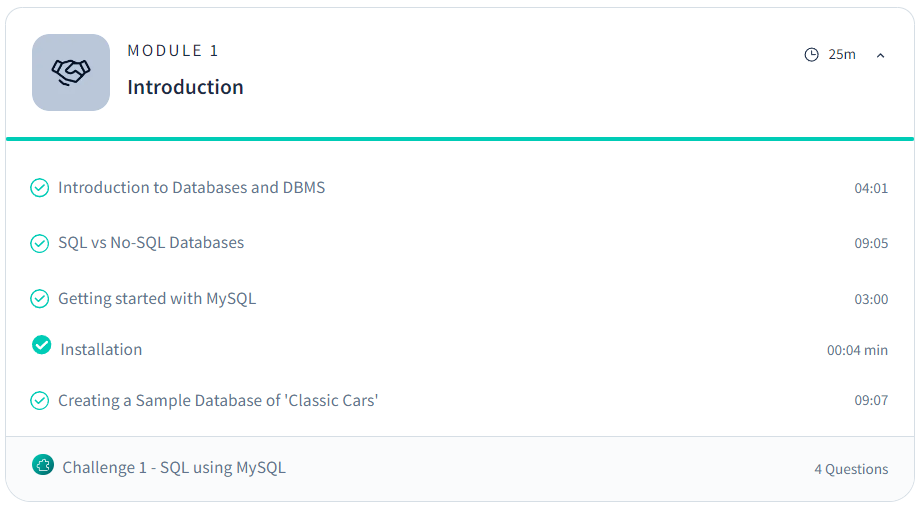
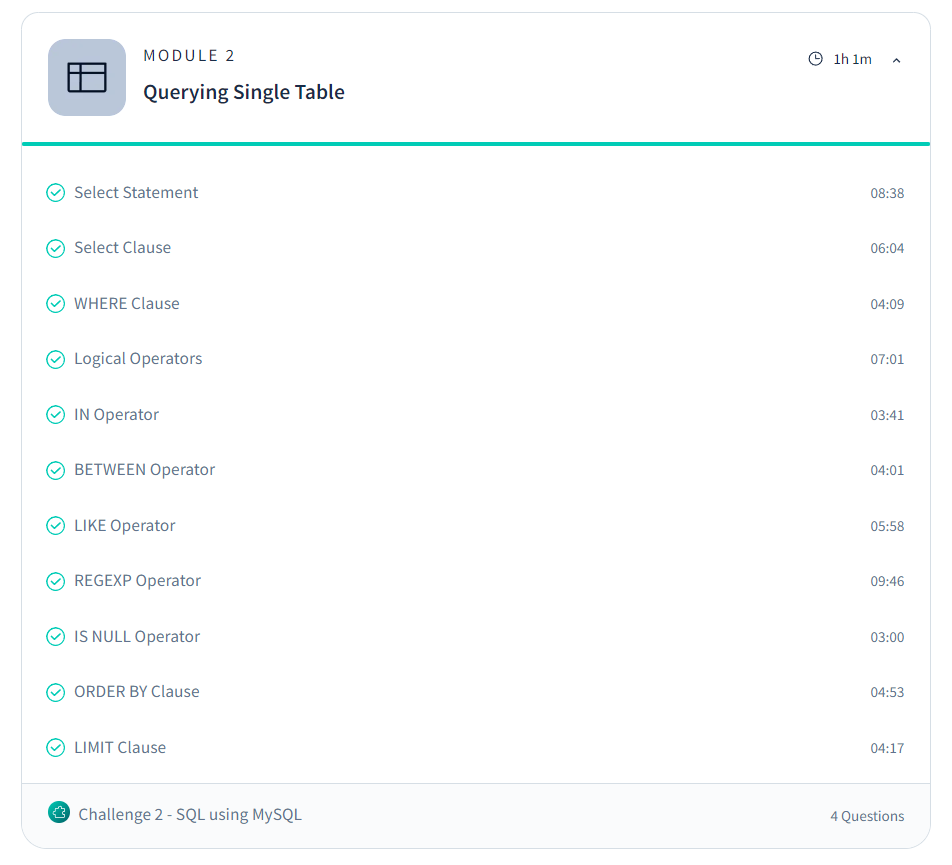

# Day 6: Revisit of SQL (Day 1)

I am revisiting SQL to deepen my understanding for Machine Learning, having previously practiced the basics in college.

## Topics Covered

### Module 1: Introduction

- Introduction to Databases, SQL vs No-SQL, and MySQL setup.
- Created a sample database of 'Classic Cars' for practice.

### Module 2: Querying a Single Table

- Basic querying using `SELECT`, `WHERE`, and logical operators.
- Used operators like `IN`, `BETWEEN`, `LIKE`, `REGEXP`, `IS NULL`.
- Practiced sorting (`ORDER BY`) and limiting results (`LIMIT`).

## Advanced Resources

- [SQL using MySQL Course - Scaler](https://www.scaler.com/topics/course/sql-using-mysql-course/)
- [MySQL Documentation](https://dev.mysql.com/doc/refman/8.0/en/)

## Tasks Completed

- Practiced querying with MySQL and completed Module 1 and Module 2 basics.
