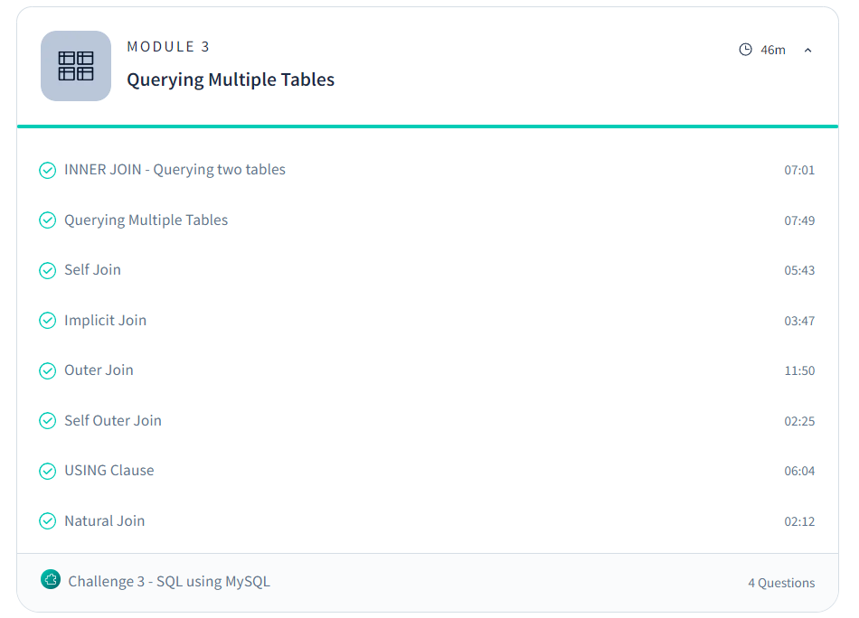

# Day 7: Revisit of SQL (Day 2)

## Topics Covered:
- INNER JOIN
- Querying Multiple Tables
- Self Join
- Implicit Join
- Outer Join
- Self Outer Join
- USING Clause
- Natural Join

### Module 3: Querying Multiple tables:

## Advanced Resources
- [SQL using MySQL Course - Scaler](https://www.scaler.com/topics/course/sql-using-mysql-course/)
- [MySQL Documentation](https://dev.mysql.com/doc/refman/8.0/en/)

## Tasks Completed:
Practiced various SQL joins and querying multiple tables.

## Further Research:
Data Aggregation and summarization.