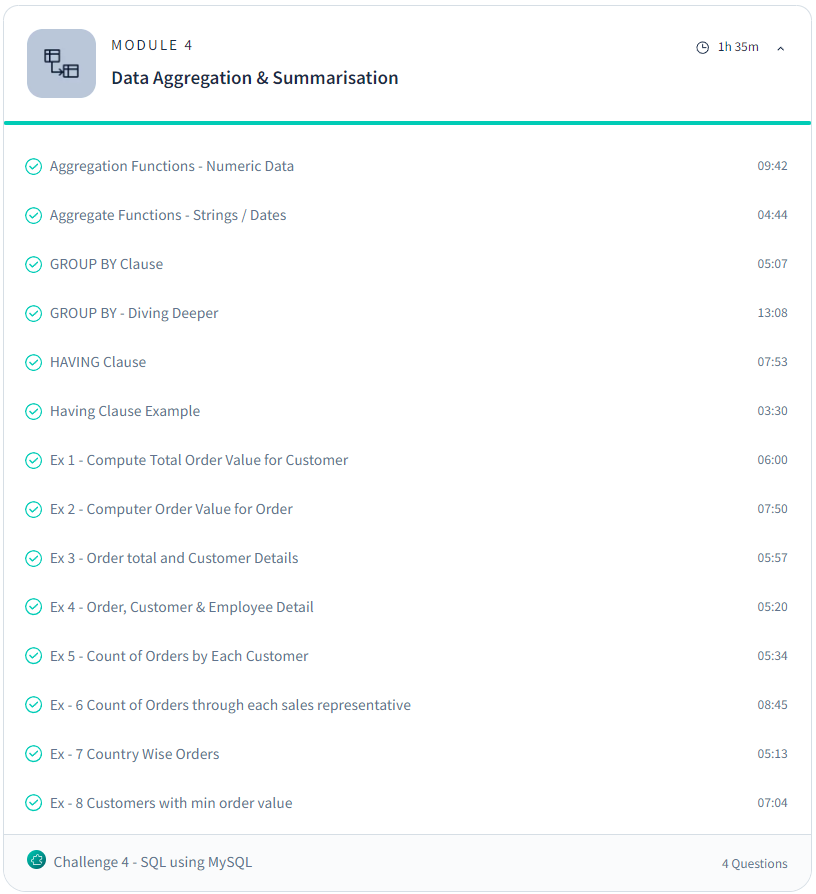

# Day 8: Revisit of SQL (Day 3)

## Topics Covered:
#### Module 3: Data Aggregation and Summarization with SQL using MySQL
***Aggregate functions: (Numeric Data)***
- **`SUM()`**: Adds up values.
- **`AVG()`**: Calculates the average of values.
- **`MIN()`**: Finds the smallest value.
- **`MAX()`**: Finds the largest value.
- **`COUNT()`**: Counts the number of rows.

***Aggregate functioms: (Strings/ Date)***
- **`COUNT()`**
- **`MIN()` / `MAX()`**: Can be used to find the earliest/latest date or the first/last value alphabetically.

***`group by` clause***:
- Organizes data into groups based on shared values.

***`Having` clause***:
- Filters those groups based on specific conditions.

## Advanced Resources:
- [SQL using MySQL Course - Scaler](https://www.scaler.com/topics/course/sql-using-mysql-course/)
- [MySQL Documentation](https://dev.mysql.com/doc/refman/8.0/en/)

## Tasks Completed:
- Completed the Exercises From the module.

## Further Research:
- Sub Queries / Complex Queries
