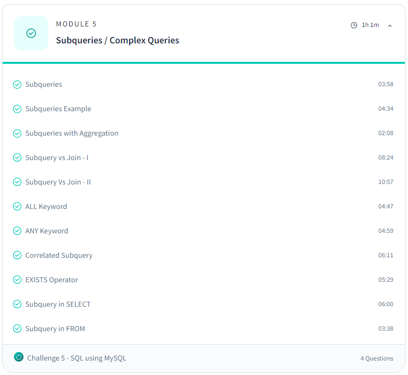

# Day 8: Revisit of SQL (Day 3)

## Topics Covered:
#### Module 5: Subqueries / Complex Queries

- **Subqueries**: 
  A query nested within another SQL query to retrieve data based on results from another query.
- **Subqueries Example**: 
- **Subqueries with Aggregation**: 
- **Subquery vs Join**: 
- **ALL Keyword**: 
- **ANY Keyword**: 
- **Correlated Subquery**: 
- **EXISTS Operator**: 
- **Subquery in SELECT**: 
- **Subquery in FROM**: 

## Advanced Resources:
- [SQL using MySQL Course - Scaler](https://www.scaler.com/topics/course/sql-using-mysql-course/)
- [MySQL Documentation](https://dev.mysql.com/doc/refman/8.0/en/)

## Tasks Completed:
- Completed exercises from the module on subqueries and complex queries.
- Practiced various examples and explored the outputs.
- [Notes Using AI + Resources](/Day%2009%20-%20Back%20to%20SQL%20Subqueries%20(Day%204)/notes.md)

