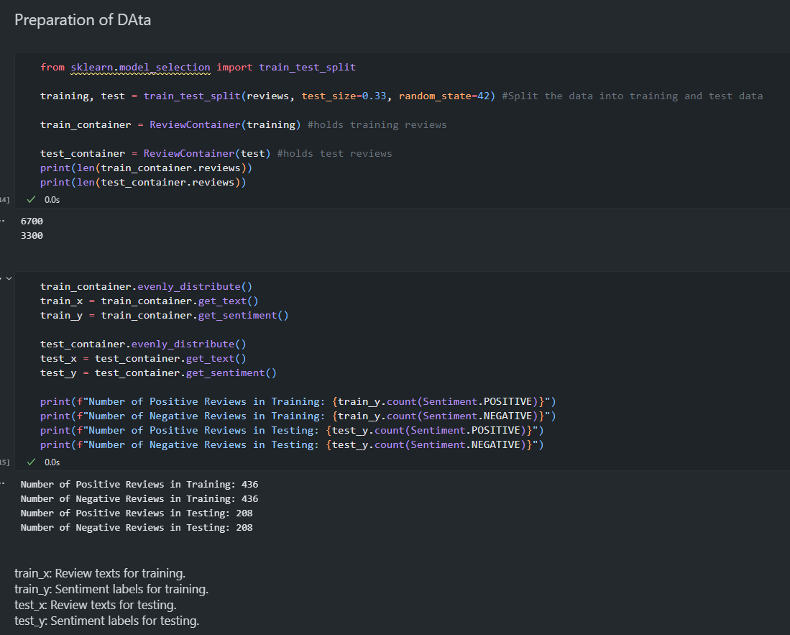

### Day 26 - Data Preparation

**Completed**:
- Downloaded and loaded the dataset into a Jupyter Notebook.
- Preprocessed and cleaned the data, including handling missing values and removing irrelevant columns.
- Organized data for modeling and prepared initial features, setting the foundation for our classification task.

**Next Steps**:
- Begin converting text data into numerical representations using vectorization techniques (Bag of Words or TF-IDF).
