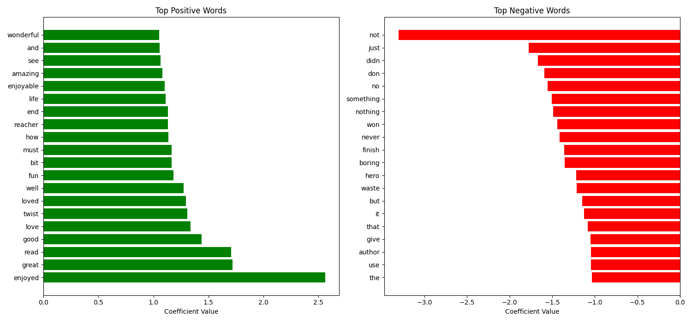
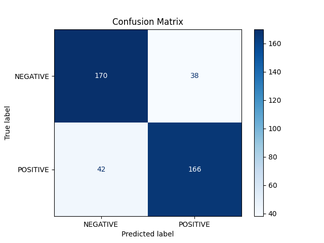

### Day 27 - Model Training

**Completed**:
- Transformed text data using vectorization methods (Bag of Words and/or TF-IDF).
- Split the data into training and testing sets.
- Experimented with several machine learning models, including:
  - Support Vector Machine (SVM)
  - Decision Tree
  - Naive Bayes
  - Logistic Regression

**Next Steps**:
- Evaluate model performance, fine-tune parameters, and choose the best model for our text classification task.
