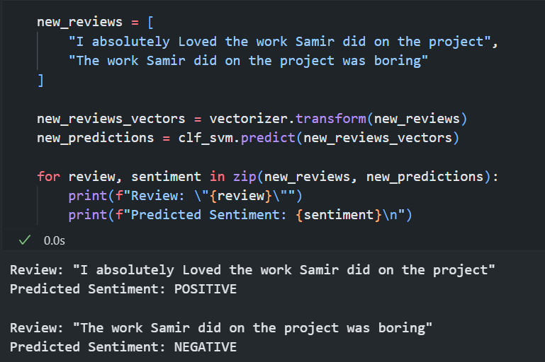
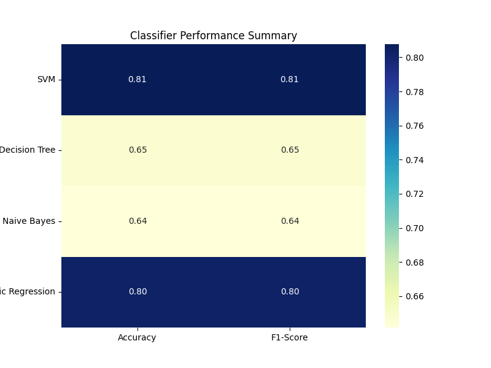

### Day 28 - Model Evaluation and Saving

**Completed**:
- Evaluated model accuracy and performance using various metrics, including F1 Score and a confusion matrix.
- Applied hyperparameter tuning with GridSearchCV to enhance model accuracy.
- Saved the final model using Pickle for future use.

**Final Insights:**
- The SVM classifier performs well with a score of approximately 80.27% on the test set, indicating good accuracy in predicting sentiments.
- Overall, the SVM classifier is effective in sentiment analysis for this dataset, and the feature analysis provides valuable insights into the language used in positive and negative reviews.
