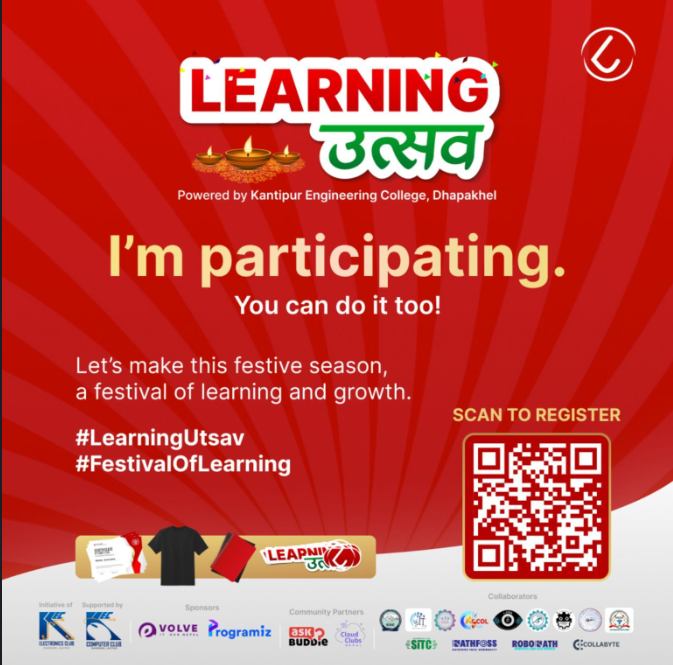

# Learning Utsav - 30 Days of Learning

I am participating in the **Learning Utsav**, powered by Kantipur Engineering College, Dhapakhel, and transforming my Dashain/Tihar celebrations into a time for learning and growth. Over the next 30 days, I’ll be documenting my progress, challenges, and achievements right here on GitHub.

## What to Expect:
- 📚 **Daily learning goals and updates**
- 🛠️ **New projects and skills development**
- 💡 **Insights on tech and learning during the festive season**

## Let's Learn Together:
Join me in making this festive season a **Festival of Learning**!  
You can also participate by scanning the QR code below to register and start your own learning journey.

Feel free to follow my journey on Twitter as well:  
Twitter: [@samirpaudel_](https://twitter.com/samirpaudel_)  

Happy Learning!  
#LearningUtsav #FestivalOfLearning #DashainTihar #LearningDays
